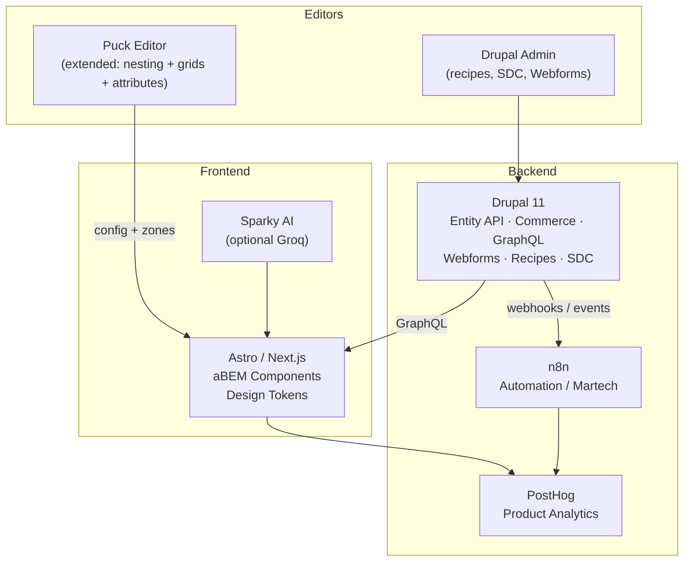

# SparkForge Architecture — v0.1 Sketch

## Key Contracts

1. **GraphQL** is the primary read/write contract between Drupal and the decoupled frontend.
2. **Puck config** is the source of truth for visual layout; SDC provides the Drupal-side component mirror.
3. **aBEM** naming is enforced in both Puck blocks and SDC templates.
4. **Events** from Commerce / Webforms / Entities flow into n8n for martech automation.
5. **PostHog** (or Plausible) captures product analytics without third-party SaaS dependency.

## Local Development

- DDEV for Drupal
- `npm run dev` for Astro/Puck frontend
- Optional Docker Compose for full stack (n8n + PostHog + frontend)

## Next Architecture Iterations

- Detailed entity model for CRM objects
- Commerce order + subscription flows mapped to n8n
- Token universe system (light/dark/brand) fully documented
- Fly.io multi-service topology
